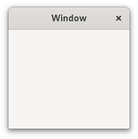

## Basics

To begin our introduction to GTK, we'll start with a very simple application. This program will create an empty 200 × 200 pixel window.



First, create a small Gradle project with the recommended layout:

```
[top-level project folder]
 ├── src/
 │    ╰── main/
 │         ├── java/
 │         │    ╰── Example0.java
 │         ╰── resources/
 ╰── build.gradle
```

Add the following content into the top-level `gradle.build` file:

```groovy
plugins {
    id 'application'
}

repositories {
    mavenCentral()
}

dependencies {
    implementation 'io.github.jwharm.javagi:gtk:0.12.0'
}

java {
    toolchain {
        languageVersion = JavaLanguageVersion.of(22)
    }
}

tasks.named('run') {
    jvmArgs += "--enable-native-access=ALL-UNNAMED"
}

application {
    mainClass = "Example0"
}
```

!!! note
    In this guide, we use Gradle to build the program and download dependencies. However, we don't use any Gradle-specific features or plugins. You can equally use Maven or any other build tool you prefer, or simply use your IDE project settings.

Enter the following content into `Example0.java`.

```java
import org.gnome.gtk.*;
import org.gnome.gio.ApplicationFlags;

public class Example0 {

  public static void main(String[] args) {
    Application app = new Application("org.gtk.example", ApplicationFlags.DEFAULT_FLAGS);
    app.onActivate(() -> {
      Window window = new ApplicationWindow(app);
      window.setTitle("Window");
      window.setDefaultSize(200, 200);
      window.present();
    });
    app.run(args);
  }
}
```

Save the java source file in the `src/main/java` folder.

You can compile and run the program with Gradle using:

```
gradle run
```

!!! tip
    If the above command does not work, make sure all prerequisites are installed:
    
    * Gradle version 8.7 or higher (check with `gradle --version`)
    
    * Java version 22 or higher (check with `java --version`)
    
    * Gtk version 4 or higher (check with `pkg-config --modversion gtk4`)
    
    * GLib version 2.74 or higher (check with `pkg-config --modversion glib-2.0`)

All GTK applications will, of course, import classes from `org.gnome.gtk`. Top-level functions and constants are in the class `org.gnome.gtk.Gtk`.

In a GTK application, the purpose of the `main()` method is to create a {{ javadoc('Gtk.Application') }} object and run it. In this example a {{ javadoc('Gtk.Application') }} instance named `app` is initialized using `new Application()`.

When creating a {{ javadoc('Gtk.Application') }}, you need to pick an application identifier (a name) and pass it to `new Application()` as parameter. For this example `org.gtk.example` is used. For choosing an identifier for your application, see [this guide](https://developer.gnome.org/documentation/tutorials/application-id.html). Lastly, `new Application()` takes `ApplicationFlags` from package `org.gnome.gio` as input for your application, if your application would have special needs. To pass a combination of multiple flags, use `Set.of(flags1, flag2, ...)`.

Next the [activate signal](https://developer.gnome.org/documentation/tutorials/application.html) is connected to a callback method (or, in this case, lambda). The `activate` signal will be emitted when your application is launched with `Application.run()` on the line below.

The `run()` call takes as arguments the command line arguments (the `args` String array). Your application can override the command line handling, e.g. to open files passed on the commandline.

Within `Application.run()` the activate signal is sent and we then proceed to handle that signal. This is where we construct our GTK window, so that a window is shown when the application is launched. The call to `new ApplicationWindow()` will create a new {{ javadoc('Gtk.ApplicationWindow') }} and store it inside the `window` variable. The window will have a frame, a title bar, and window controls depending on the platform.

A window title is set using {{ javadoc('Window.setTitle') }}. This method takes a String as input. Finally the window size is set using {{ javadoc('Window.setDefaultSize') }} and the window is then shown by GTK via {{ javadoc('Window.present') }}.

When you close the window, by (for example) pressing the X button, the `Application.run()` call returns and the application exits. In a C app, a call to `g_object_unref` would be required here to free the `Application` object. In Java, a [Cleaner](https://docs.oracle.com/en/java/javase/22/docs/api/java.base/java/lang/ref/Cleaner.html) will do this after the garbage collector has freed the `Application` object.

While the program is running, GTK is receiving _events_. These are typically input events caused by the user interacting with your program, but also things like messages from the window manager or other applications. GTK processes these and as a result, _signals_ may be emitted on your widgets. Connecting handlers for these signals is how you normally make your program do something in response to user input.

The following example is slightly more complex, and tries to showcase some of the capabilities of GTK.

[Previous](getting_started_00.md){ .md-button } [Next](getting_started_02.md){ .md-button }
