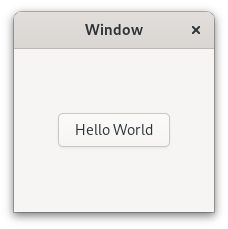

In the long tradition of programming languages and libraries, this example is called *Hello, World*.



### Hello World in Java

Create a new file with the following content named `Example1.java` in the folder `src/main/java`.

```java
import org.gnome.gtk.*;
import org.gnome.gio.ApplicationFlags;

public class Example1 {

  private static void printHello() {
    System.out.println("Hello World");
  }

  private static void activate(Application app) {
    Window window = new ApplicationWindow(app);
    window.setTitle("Window");
    window.setDefaultSize(200, 200);

    Box box = new Box(Orientation.VERTICAL, 0);
    box.setHalign(Align.CENTER);
    box.setValign(Align.CENTER);

    window.setChild(box);

    Button button = Button.withLabel("Hello World");

    button.onClicked(Example1::printHello);
    button.onClicked(window::destroy);

    box.append(button);

    window.present();
  }

  public static void main(String[] args) {
    Application app = new Application("org.gtk.example", ApplicationFlags.DEFAULT_FLAGS);
    app.onActivate(() -> activate(app));
    app.run(args);
  }
}
```

Change the final part of the `build.gradle` file to run `Example1.java`, and run it with `gradle run`:

```groovy
application {
    mainClass = "Example1"
}
```

As seen above, `Example1.java` builds further upon `Example0.java` by adding a button to our window, with the label "Hello World". The handling of the `activate` event has been moved into a separate method for clarity. Two new GTK widgets are used to accomplish this, `button` and `box`. The box variable is created to store a {{ javadoc('Gtk.Box') }}, which is GTK's way of controlling the size and layout of buttons.

The `GtkBox` widget is created with {{ javadoc('Gtk.Grid.Grid()') }}, which takes a {{ javadoc('Gtk.Orientation') }} enumeration value as parameter. The buttons which this box will contain can either be laid out horizontally or vertically. This does not matter in this particular case, as we are dealing with only one button. After initializing box with the newly created `GtkBox`, the code adds the box widget to the window widget using {{ javadoc('Gtk.Window.setChild') }}.

Next the `button` variable is initialized in similar manner. {{ javadoc('Button.withLabel') }} is called which returns a {{ javadoc('Gtk.Button') }} to be stored in `button`. Afterwards `button` is added to our `box`.

Using `onClicked()`, the button is connected to a method in our app called `printHello()`, so that when the button is clicked, GTK will call this method. `printHello()` calls `System.out.println()` with the string "Hello World" which will print Hello World in a terminal if the GTK application was started from one.

After connecting `printHello()`, another signal is connected to the "clicked" state of the button using `onClicked()` as well. In this case the method being called back is {{ javadoc('Gtk.Window.destroy') }} for the `window` we created. This has the effect that when the button is clicked, the whole GTK window is destroyed.

More information about creating buttons can be found [here](https://wiki.gnome.org/HowDoI/Buttons).

The rest of the code in `Example1.java` is identical to `Example0.java`. The next section will elaborate further on how to add several {{ javadoc('Widget') }}s to your GTK application.

[Previous](getting_started_01.md){ .md-button } [Next](getting_started_03.md){ .md-button }
