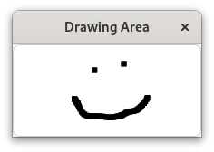

Many widgets, like buttons, do all their drawing themselves. You just tell them the label you want to see, and they figure out what font to use, draw the button outline and focus rectangle, etc. Sometimes, it is necessary to do some custom drawing. In that case, a {{ javadoc('DrawingArea') }} might be the right widget to use. It offers a canvas on which you can draw by setting its draw function.

The contents of a widget often need to be partially or fully redrawn, e.g. when another window is moved and uncovers part of the widget, or when the window containing it is resized. It is also possible to explicitly cause a widget to be redrawn, by calling {{ javadoc('Widget.queueDraw') }}. GTK takes care of most of the details by providing a ready-to-use cairo context to the draw function.

The following example shows how to use a draw function with {{ javadoc('DrawingArea') }}. It is a bit more complicated than the previous examples, since it also demonstrates input event handling with event controllers.



### Drawing in response to input

Create a new file with the following content named `Example3.java`.

```java
import org.freedesktop.cairo.*;
import org.gnome.gtk.*;
import org.gnome.gdk.Gdk;
import org.gnome.gio.ApplicationFlags;
import java.io.IOException;

public class Example3 {

  private final Application app;
  
  // Surface to store current scribbles
  private Surface surface = null;
  private DrawingArea drawingArea;
  
  private double startX;
  private double startY;

  private void clearSurface() {
    try {
      Context cr = Context.create(this.surface);
      cr.setSourceRGB(1, 1, 1);
      cr.paint();
    } catch (IOException ignored) {}
  }
  
  // Create a new surface of the appropriate size to store our scribbles
  private void resize(Widget widget) {
    if (widget.getNative().getSurface() != null) {
      this.surface = ImageSurface.create(
              Format.ARGB32, widget.getWidth(), widget.getHeight());

      // Initialize the surface to white
      clearSurface();
    }
  }

  /*
   * Redraw the screen from the surface. Note that the draw
   * callback receives a ready-to-be-used Context that is already
   * clipped to only draw the exposed areas of the widget
   */
  private void redraw(DrawingArea area, Context cr, int width, int height) {
    cr.setSource(this.surface, 0, 0);
    cr.paint();
  }
  
  // Draw a rectangle on the surface at the given position
  private void drawBrush(double x, double y) {
    try {
      // Paint to the surface, where we store our state
      Context cr = Context.create(this.surface);
      
      cr.rectangle(x - 3, y - 3, 6, 6);
      cr.fill();
    } catch (IOException ignored) {}
    
    // Now invalidate the drawing area.
    drawingArea.queueDraw();
  }

  private void dragBegin(double x, double y) {
    this.startX = x;
    this.startY = y;
    drawBrush(x, y);
  }

  private void dragUpdate(double x, double y) {
    drawBrush(startX + x, startY + y);
  }

  private void dragEnd(double x, double y) {
    drawBrush(startX + x, startY + y);
  }

  private void pressed() {
    clearSurface();
    drawingArea.queueDraw();
  }

  private void activate() {
    Window window = new ApplicationWindow(this.app);
    window.setTitle("Drawing Area");
    
    Frame frame = new Frame((String) null);
    window.setChild(frame);
    
    drawingArea = new DrawingArea();
    // set a minimum size
    drawingArea.setSizeRequest(100, 100);
    
    frame.setChild(drawingArea);
    
    drawingArea.setDrawFunc(this::redraw);

    // Connect to the "resize" signal with "after"=true
    var callback = (DrawingArea.ResizeCallback) (x, y) -> resize(drawingArea);
    drawingArea.connect("resize", callback, true);

    GestureDrag drag = new GestureDrag();
    drag.setButton(Gdk.BUTTON_PRIMARY);
    drawingArea.addController(drag);
    drag.onDragBegin(this::dragBegin);
    drag.onDragUpdate(this::dragUpdate);
    drag.onDragEnd(this::dragEnd);
    
    GestureClick press = new GestureClick();
    press.setButton(Gdk.BUTTON_SECONDARY);
    drawingArea.addController(press);
    
    press.onPressed((n, x, y) -> pressed());
    
    window.present();
  }
  
  public Example3(String[] args) {
    this.app = new Application("org.gtk.example", ApplicationFlags.DEFAULT_FLAGS);
    app.onActivate(this::activate);
    app.run(args);
  }

  public static void main(String[] args) {
    new Example3(args);
  }
}
```

Update the `mainClass` in `build.gradle` to `Example3` and test the program with `gradle run`.

[Previous](getting_started_03.md){ .md-button } [Next](getting_started_05.md){ .md-button }
