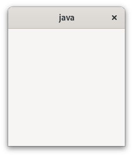

An application consists of a number of files:

The binary
: This gets installed in `/usr/bin`.

A desktop file
: The desktop file provides important information about the application to the desktop shell, such as its name, icon, D-Bus name, commandline to launch it, etc. It is installed in `/usr/share/applications`.

An icon
: The icon gets installed in `/usr/share/icons/hicolor/48x48/apps`, where it will be found regardless of the current theme.

A settings schema
: If the application uses GSettings, it will install its schema in `/usr/share/glib-2.0/schemas`, so that tools like dconf-editor can find it.

#### Other resources
Other files, such as GtkBuilder ui files, are best loaded from resources stored in the application binary itself (in case of a native application) or, for a Java application, as a resource in the jar file. This eliminates the need for most of the files that would traditionally be installed in an application-specific location in `/usr/share`.

GTK includes application support that is built on top of `GApplication`. In this tutorial we'll build a simple application by starting from scratch, adding more and more pieces over time. Along the way, we'll learn about {{ javadoc('Gtk.Application') }}, templates, resources, application menus, settings, {{ javadoc('Gtk.HeaderBar') }}, {{ javadoc('Gtk.Stack') }}, {{ javadoc('Gtk.SearchBar') }}, {{ javadoc('Gtk.ListBox') }}, and more.

The full, buildable sources for these examples can be found [online](https://github.com/jwharm/java-gi-examples/tree/main/GettingStarted) on GitHub. You can build each example separately by using Gradle with the `build.gradle` file. For more information, see the `README.md` file included in the examples repository.

### A trivial application

When using `GtkApplication`, the `main()` method can be very simple. We just call `Application.run()` on an instance of our application class.

```java
public class ExampleMainClass {

  public static void main(String[] args) {
    ExampleApp.create().run(args);
  }
}
```

All the application logic is in the application class, which is a subclass of the GTK `Application` class. Our example does not yet have any interesting functionality. All it does is open a window when it is activated without arguments, and open the files it is given, if it is started with arguments.

To handle these two cases, we override the `activate()` method, which gets called when the application is launched without commandline arguments, and the `open()` method, which gets called when the application is launched with commandline arguments.

To learn more about `GApplication` entry points, consult the GIO [documentation](https://docs.gtk.org/gio/class.Application.html).

```java
import io.github.jwharm.javagi.gtk.types.Types;
import org.gnome.gio.ApplicationFlags;
import org.gnome.gio.File;
import org.gnome.glib.List;
import org.gnome.glib.Type;
import org.gnome.gobject.GObject;
import org.gnome.gtk.Application;
import org.gnome.gtk.Window;
import java.lang.foreign.MemorySegment;

public class ExampleApp extends Application {

  // Register this Java class with the GObject type system
  private static final Type gtype = Types.register(ExampleApp.class);

  public static Type getType() {
    return gtype;
  }

  public ExampleApp(MemorySegment address) {
    super(address);
  }

  @Override
  public void activate() {
    ExampleAppWindow win = ExampleAppWindow.create(this);
    win.present();
  }

  @Override
  public void open(File[] files, String hint) {
    ExampleAppWindow win;
    List<Window> windows = super.getWindows();
    if (!windows.isEmpty())
      win = (ExampleAppWindow) windows.getFirst();
    else
      win = ExampleAppWindow.create(this);

    for (File file : files)
      win.open(file);

    win.present();
  }

  public static ExampleApp create() {
    return GObject.newInstance(getType(),
        "application-id", "org.gtk.exampleapp",
        "flags", ApplicationFlags.HANDLES_OPEN,
        null);
  }
}
```

Another important class that is part of the application support in GTK is {{ javadoc('Gtk.ApplicationWindow') }}. It is typically subclassed as well. Our subclass does not do anything yet, so we will just get an empty window.

```java
import io.github.jwharm.javagi.gtk.types.Types;
import org.gnome.gio.File;
import org.gnome.glib.Type;
import org.gnome.gobject.GObject;
import org.gnome.gtk.ApplicationWindow;
import java.lang.foreign.MemorySegment;

public class ExampleAppWindow extends ApplicationWindow {

  private static final Type gtype = Types.register(ExampleAppWindow.class);

  public static Type getType() {
    return gtype;
  }

  public ExampleAppWindow(MemorySegment address) {
    super(address);
  }

  public static ExampleAppWindow create(ExampleApp app) {
    return GObject.newInstance(getType(), "application", app, null);
  }

  public void open(File file) {
  }
}
```

As part of the initial setup of our application, we also create an icon and a desktop file.


```
[Desktop Entry]
Type=Application
Name=Example
Icon=exampleapp
StartupNotify=true
Exec=@bindir@/exampleapp
```

Note that `@bindir@` needs to be replaced with the actual path to the binary before this desktop file can be used.

[Full source](https://github.com/jwharm/java-gi-examples/tree/main/GettingStarted/example-5-part1)

Here is what we've achieved so far:



This does not look very impressive yet, but our application is already presenting itself on the session bus, it has single-instance semantics, and it accepts files as commandline arguments.

[Previous](getting_started_05.md){ .md-button } [Next](getting_started_07.md){ .md-button }
