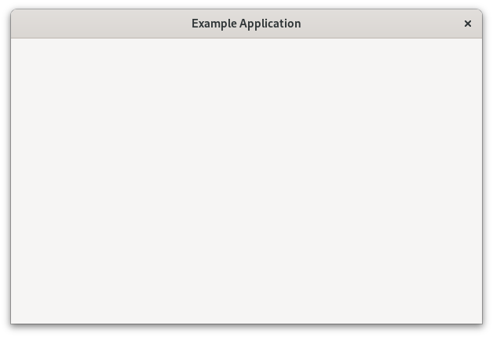

In this step, we use a `GtkBuilder` template to associate a `GtkBuilder` ui file with our application window class.

Our simple ui file gives the window a title, and puts a `GtkStack` widget as the main content.

```xml
<?xml version="1.0" encoding="UTF-8"?>
<interface>
  <template class="ExampleAppWindow" parent="GtkApplicationWindow">
    <property name="title" translatable="yes">Example Application</property>
    <property name="default-width">600</property>
    <property name="default-height">400</property>
    <child>
      <object class="GtkBox" id="content_box">
        <property name="orientation">vertical</property>
        <child>
          <object class="GtkStack" id="stack"/>
        </child>
      </object>
    </child>
  </template>
</interface>
```

To make use of this file in our application, we revisit our `GtkApplicationWindow` subclass, and add a `GtkTemplate` annotation. The annotation is processed by the `TemplateTypes.register()` method. It will call {{ doc('method@Gtk.WidgetClass.set_template_from_resource') }} from the class init function to set the ui file as template for this class, and call {{ doc('method@Gtk.Widget.init_template') }} in the instance init function to instantiate the template for each instance of our class.

```java
 ...

@GtkTemplate(ui="/org/gtk/exampleapp/window.ui")
public class ExampleAppWindow extends ApplicationWindow {

 ...
```

Now we need to use [GLib's resource functionality](https://docs.gtk.org/gio/struct.Resource.html) to compile the ui file into a binary resource file. This is commonly done by listing all resources in a `.gresource.xml` file, such as this:

```xml
<?xml version="1.0" encoding="UTF-8"?>
<gresources>
  <gresource prefix="/org/gtk/exampleapp">
    <file preprocess="xml-stripblanks">window.ui</file>
  </gresource>
</gresources>
```

To create the binary resource file, we use the `glib-compile-resources` utility:

```
glib-compile-resources exampleapp.gresource.xml
```

You can run this automatically before Gradle compiles the application, by adding a custom task to `build.gradle`:

```groovy
tasks.register('compileResources') {
    exec {
        workingDir 'src/main/resources'
        commandLine 'glib-compile-resources', 'exampleapp.gresource.xml'
    }
}

tasks.named('classes') {
    dependsOn compileResources
}
```

Finally, we must update the `main()` method to load the resource file and register it:

```java
import io.github.jwharm.javagi.base.GErrorException;
import org.gnome.gio.Resource;

public class ExampleMainClass {

  public static void main(String[] args) throws GErrorException {
    var resource = Resource.load("src/main/resources/exampleapp.gresource");
    resource.resourcesRegister();

    ExampleApp.create().run(args);
  }
}
```

[Full source](https://github.com/jwharm/java-gi-examples/tree/main/GettingStarted/example-5-part2)

!!! note
    The `Resource.load()` method throws a `GErrorException`. This exception indicates that the native GTK function signaled an error in a `GError` out-parameter.

Our application now looks like this:



[Previous](getting_started_06.md){ .md-button } [Next](getting_started_08.md){ .md-button }
