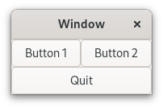

When creating an application, you'll want to put more than one widget inside a window. When you do so, it becomes important to control how each widget is positioned and sized. This is where packing comes in.

GTK comes with a large variety of _layout containers_ whose purpose it is to control the layout of the child widgets that are added to them, like:

- {{ javadoc('Gtk.Box') }}
- {{ javadoc('Gtk.Grid') }}
- {{ javadoc('Gtk.Revealer') }}
- {{ javadoc('Gtk.Stack') }}
- {{ javadoc('Gtk.Overlay') }}
- {{ javadoc('Gtk.Paned') }}
- {{ javadoc('Gtk.Expander') }}
- {{ javadoc('Gtk.Fixed') }}

The following example shows how the {{ javadoc('Gtk.Grid') }} container lets you arrange several buttons:



### Packing buttons

Create a new file with the following content named `Example2.java`.

```java
import org.gnome.gtk.*;
import org.gnome.gio.ApplicationFlags;

public class Example2 {

  private static void printHello() {
    System.out.println("Hello World");
  }

  private static void activate(Application app) {
    // create a new window, and set its title
    Window window = new ApplicationWindow(app);
    window.setTitle("Window");
    
    // Here we construct the container that is going pack our buttons
    Grid grid = new Grid();
    
    // Pack the container in the window
    window.setChild(grid);
    
    Button button = Button.withLabel("Button 1");
    button.onClicked(Example2::printHello);
    
    // Place the first button in the grid cell (0, 0), and make it fill
    // just 1 cell horizontally and vertically (ie no spanning)
    grid.attach(button, 0, 0, 1, 1);
    
    button = Button.withLabel("Button 2");
    button.onClicked(Example2::printHello);
    
    // Place the second button in the grid cell (1, 0), and make it fill
    // just 1 cell horizontally and vertically (ie no spanning)
    grid.attach(button, 1, 0, 1, 1);
    
    button = Button.withLabel("Quit");
    button.onClicked(window::destroy);

    // Place the Quit button in the grid cell (0, 1), and make it
    // span 2 columns.
    grid.attach(button, 0, 1, 2, 1);

    window.present();
  }

  public static void main(String[] args) {
    Application app = new Application("org.gtk.example", ApplicationFlags.DEFAULT_FLAGS);
    app.onActivate(() -> activate(app));
    app.run(args);
  }
}
```

Update the `mainClass` in `build.gradle` to `Example2` and test the program with `gradle run`.

[Previous](getting_started_02.md){ .md-button } [Next](getting_started_04.md){ .md-button }
