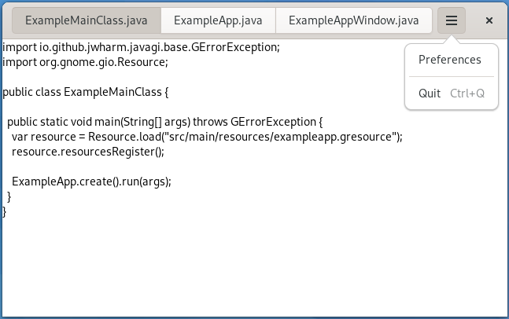

The menu is shown at the right side of the headerbar. It is meant to collect infrequently used actions that affect the whole application.

Just like the window template, we specify our menu in a ui file, and add it as a resource to our binary.

```xml
<?xml version="1.0" encoding="UTF-8"?>
<interface>
  <menu id="menu">
    <section>
      <item>
        <attribute name="label" translatable="yes">_Preferences</attribute>
        <attribute name="action">app.preferences</attribute>
      </item>
    </section>
    <section>
      <item>
        <attribute name="label" translatable="yes">_Quit</attribute>
        <attribute name="action">app.quit</attribute>
      </item>
    </section>
  </menu>
</interface>
```

To make the menu appear, we have to load the ui file and associate the resulting menu model with the menu button that we've added to the headerbar. Since menus work by activating GActions, we also have to add a suitable set of actions to our application.

We add an `@InstanceInit`-annotated method to the window class (called once by Gtk during construction) that attaches the menu model to the menu button:

```java
...

@GtkChild
public MenuButton gears;

@InstanceInit
public void init() {
  var builder = GtkBuilder.fromResource("/org/gtk/exampleapp/gears-menu.ui");
  var menu = (MenuModel) builder.getObject("menu");
  gears.setMenuModel(menu);
}

...
```

Adding the actions is best done in the `startup()` method, which is guaranteed to be called once for each primary application instance:

```java
...

public void preferencesActivated(Variant parameter) {
}

public void quitActivated(Variant parameter) {
  super.quit();
}

@Override
public void startup() {
  var preferences = new SimpleAction("preferences", null);
  preferences.onActivate(this::preferencesActivated);
  addAction(preferences);

  var quit = new SimpleAction("quit", null);
  quit.onActivate(this::quitActivated);
  addAction(quit);

  String[] quitAccels = new String[]{"<Ctrl>q"};
  setAccelsForAction("app.quit", quitAccels);
}

...
```

[Full source](part4)

Our preferences menu item does not do anything yet, but the Quit menu item is fully functional. Note that it can also be activated by the usual Ctrl-Q shortcut. The shortcut was added with {{ javadoc('Application.setAccelsForAction') }}.

The application menu looks like this:



[Previous](getting_started_08.md){ .md-button } [Next](getting_started_10.md){ .md-button }
