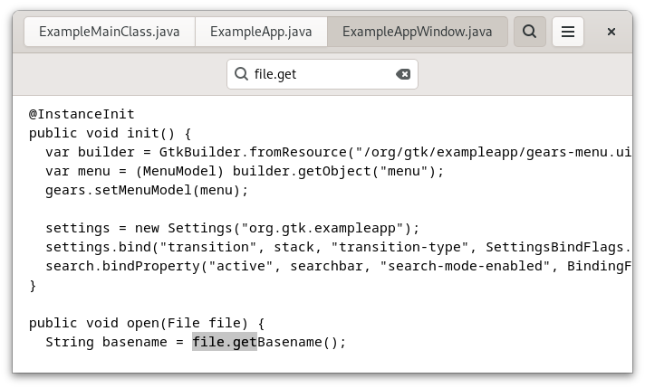

We continue to flesh out the functionality of our application. For now, we add search. GTK supports this with {{ javadoc('Gtk.SearchEntry') }} and {{ javadoc('Gtk.SearchBar') }}. The search bar is a widget that can slide in from the top to present a search entry.

We add a toggle button to the header bar, which can be used to slide out the search bar below the header bar.

```xml
<?xml version="1.0" encoding="UTF-8"?>
<interface>
  <template class="ExampleAppWindow" parent="GtkApplicationWindow">
    <property name="title" translatable="yes">Example Application</property>
    <property name="default-width">600</property>
    <property name="default-height">400</property>
    <child type="titlebar">
      <object class="GtkHeaderBar" id="header">
        <child type="title">
          <object class="GtkStackSwitcher" id="tabs">
            <property name="stack">stack</property>
          </object>
        </child>
        <child type="end">
          <object class="GtkMenuButton" id="gears">
            <property name="direction">none</property>
          </object>
        </child>
        <child type="end">
          <object class="GtkToggleButton" id="search">
            <property name="sensitive">0</property>
            <property name="icon-name">edit-find-symbolic</property>
          </object>
        </child>
      </object>
    </child>
    <child>
      <object class="GtkBox" id="content_box">
        <property name="orientation">vertical</property>
        <child>
          <object class="GtkSearchBar" id="searchbar">
            <child>
              <object class="GtkSearchEntry" id="searchentry">
                <signal name="search-changed" handler="search_text_changed"/>
              </object>
            </child>
          </object>
        </child>
        <child>
          <object class="GtkStack" id="stack">
            <signal name="notify::visible-child" handler="visible_child_changed"/>
          </object>
        </child>
      </object>
    </child>
  </template>
</interface>
```

Implementing the search needs quite a few code changes that we are not going to completely go over here. The central piece of the search implementation is a signal handler that listens for text changes in the search entry.

```java
...

@GtkCallback(name="search_text_changed")
public void searchTextChanged() {
  String text = searchentry.getText();

  if (text.isEmpty())
    return;

  var tab = (ScrolledWindow) stack.getVisibleChild();
  var view = (TextView) tab.getChild();
  var buffer = view.getBuffer();

  // Very simple-minded search implementation
  TextIter startIter = new TextIter();
  TextIter matchStart = new TextIter();
  TextIter matchEnd = new TextIter();
  buffer.getStartIter(startIter);
  if (startIter.forwardSearch(text, TextSearchFlags.CASE_INSENSITIVE,
                              matchStart, matchEnd, null)) {
    buffer.selectRange(matchStart, matchEnd);
    view.scrollToIter(matchStart, 0.0, false, 0.0, 0.0);
  }
}

...
```

[Full source](part7)

With the search bar, our application now looks like this:



[Previous](getting_started_10.md){ .md-button } [Next](getting_started_12.md){ .md-button }
