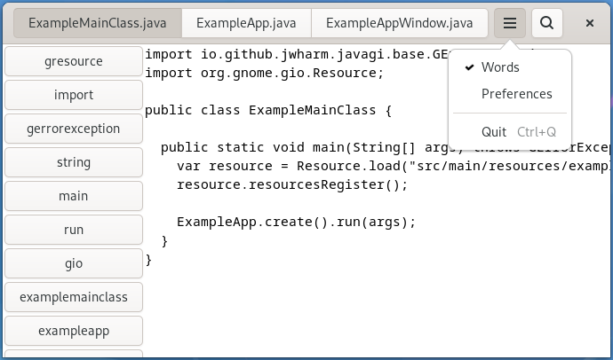

As another piece of functionality, we are adding a sidebar, which demonstrates {{ javadoc('Gtk.MenuButton') }}, {{ javadoc('Gtk.Revealer') }} and {{ javadoc('Gtk.ListBox') }}.

```xml
<?xml version="1.0" encoding="UTF-8"?>
<interface>
  <template class="ExampleAppWindow" parent="GtkApplicationWindow">
    <property name="title" translatable="yes">Example Application</property>
    <property name="default-width">600</property>
    <property name="default-height">400</property>
    <child type="titlebar">
      <object class="GtkHeaderBar" id="header">
        <child type="title">
          <object class="GtkStackSwitcher" id="tabs">
            <property name="stack">stack</property>
          </object>
        </child>
        <child type="end">
          <object class="GtkToggleButton" id="search">
            <property name="sensitive">0</property>
            <property name="icon-name">edit-find-symbolic</property>
          </object>
        </child>
        <child type="end">
          <object class="GtkMenuButton" id="gears">
            <property name="direction">none</property>
          </object>
        </child>
      </object>
    </child>
    <child>
      <object class="GtkBox" id="content_box">
        <property name="orientation">vertical</property>
        <child>
          <object class="GtkSearchBar" id="searchbar">
            <child>
              <object class="GtkSearchEntry" id="searchentry">
                <signal name="search-changed" handler="search_text_changed"/>
              </object>
            </child>
          </object>
        </child>
        <child>
          <object class="GtkBox" id="hbox">
            <child>
              <object class="GtkRevealer" id="sidebar">
                <property name="transition-type">slide-right</property>
                <child>
                  <object class="GtkScrolledWindow" id="sidebar-sw">
                    <property name="hscrollbar-policy">never</property>
                    <child>
                      <object class="GtkListBox" id="words">
                        <property name="selection-mode">none</property>
                      </object>
                    </child>
                  </object>
                </child>
              </object>
            </child>
            <child>
              <object class="GtkStack" id="stack">
                <signal name="notify::visible-child" handler="visible_child_changed"/>
              </object>
            </child>
          </object>
        </child>
      </object>
    </child>
  </template>
</interface>
```

The code to populate the sidebar with buttons for the words found in each file is a little too involved to go into here. But we'll look at the code to add a checkbutton for the new feature to the menu.

```xml
<?xml version="1.0" encoding="UTF-8"?>
<interface>
  <menu id="menu">
    <section>
      <item>
        <attribute name="label" translatable="yes">_Words</attribute>
        <attribute name="action">win.show-words</attribute>
      </item>
      <item>
        <attribute name="label" translatable="yes">_Preferences</attribute>
        <attribute name="action">app.preferences</attribute>
      </item>
    </section>
    <section>
      <item>
        <attribute name="label" translatable="yes">_Quit</attribute>
        <attribute name="action">app.quit</attribute>
      </item>
    </section>
  </menu>
</interface>
```

To connect the menuitem to the show-words setting, we use a `GAction` corresponding to the given `GSettings` key.

```java
...

@InstanceInit
public void init() {
  ...

  addAction(settings.createAction("show-words"));
}

...
```

[Full source](part8)

What our application looks like now:



[Previous](getting_started_11.md){ .md-button } [Next](getting_started_13.md){ .md-button }
